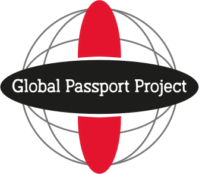

# The Global Passport Project

Global Passport Project is a breakthrough initiative that leverages on decentralized technology to support mixed migrants along their journey, protect their privacy while reporting human rights violations, and engage them as citizens integrating in their new communities. GPP will also enormously improve the capacity of NGOs and social enterprises to reach out to migrants and design their actions, thus streamlining their resources and improving their performance and records when applying for funds and calls.

GPP is a blockchain-based platform with a website and mobile App through which mixed migrants can safely store important documents, access info on
the countries crossed and the solidarity network in the area they are in, as well as report on abuses they might face along the journey. All data is personal and inviolable, and it will be kept on Blockchain with a double-level encryption component.

* GPP’s key tool is the first ever DocWallet, a unique and innovative "safe space" where migrants can scan and upload their ID, educational or medical records that might get lost during their journey or might not be convenient to keep them physically with them. The lack of documentation is often a key issue in the migratory process.

* GPP App will provide the user with a detailed and comprehensive mapping of solidarity structures in transit/destination countries: upon voluntary geolocalization, an interactive map will provide information on the structures (i.e. associations, collectives, unions, NGOs, lawyers, humanitarian protection) and also up-to-date information on the legislation in force in every country and territory crossed.

* GPP is also a multimedia tool for mixed migrant to report and document abuses faced along the journey after being provided with a brief tutorial on citizen journalism.

The platform is designed WITH migrants rather than FOR migrants: they are the main and ultimate beneficiaries of this project, whose aim is to enable them to embark in safer journeys and experience an easier settling, but also to engage them as active subjects of participatory democracy practices and a narrative process that will start from their first hand experiences as narrating subjects rather than narrated ones.

It is meant to serve as an innovative tool also for the third sector (NGOs, aid agencies) to access information and first-hand data that go beyond government control and a useful tool to improve and strengthen their interventions. GPP may also contribute to an in-depth reconsideration of the operational modalities which are very often blamed for adopting a top-down approach. The possibility to receive detailed information and to be able to directly get in contact with their targets and potential beneficiaries will allow to improve the effectiveness and efficiency of their actions, and ensure a streamlined use of the resources.

## The Technology

We plan to use the following technologies but we are evaluating alternative components with existing decentralized technologies and are open for discussion:

 - Node.js, Loopback4, Typescript, PostgreSQL (back-end)
 - Angular 9, CoreUI, Typescript (front-end)
 - React Native, DECode App (mobile app)
 - Restroom, Sawtooth, IPFS (blockchain)

## The Repos

###  GPP_backend
 - [GPP_backend](https://github.com/LedgerProject/GPP_backend)
 - ***GPP_backend*** contains most of the business logic: JWT authentication strategy, write and read data in the database, does cryptography on chunks files with zenroom, expose endpoints needed by front-end and mobile app.
 - It requires Node.js 8.9 or above and PostgreSQL 13 or above.
 - This repository is needed by GPP_frontend.

###  GPP_frontend
 - [GPP_frontend](https://github.com/LedgerProject/GPP_frontend)
 - ***GPP_frontend*** TODO - does basic cryptography and contains most of the business logic.
 - It requires Angular 9 or above.
 - It connects to GPP_backend to call the available endpoints.

## Misc

This stuff  **is in bold** and this is ***in italic*** 

## Links

This how to link, it works both internal: [Basic info](/general/basic.md "The Basic info") and external: [Zenroom home](https://zenroom.org/) and this is simple external link  <https://zenroom.org/>, plain html works too.

## Pics 

Load a local pic like this: 

Load an external pic like this: 

